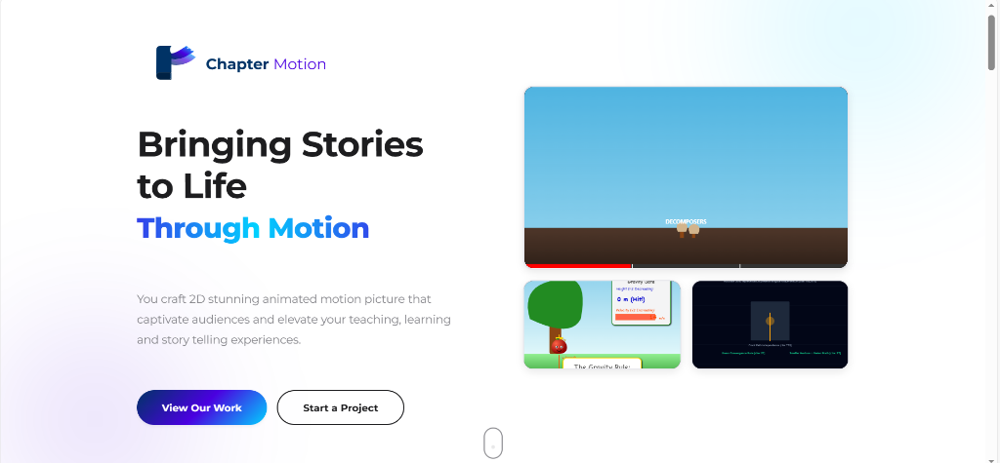
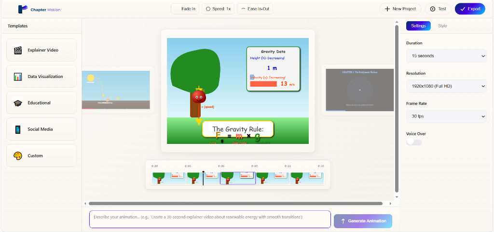

# Chapter Motion

<div align="center">


### **AI-Powered Animation Studio for Educators**

Transform complex concepts into stunning educational animations with the power of AI and Manim.

[](https://reactjs.org/)
[](https://vitejs.dev/)
[](https://www.manim.community/)
[](https://github.com/3b1b/manim)

[🚀 Live Demo](#) • [📖 Documentation](#) • [🎓 Tutorials](#) • [💬 Community](#)

</div>

---

## ✨ Features

### 🎨 **Professional Animation Editor**
- **Apple-Inspired Design** - Creamy gradient theme with intuitive interface
- **Interactive Timeline** - CapCut-style timeline with frame thumbnails
- **SVG Carousel** - Preview and switch between multiple animations
- **Real-time Preview** - See your animations as you create them

### 🤖 **AI-Powered Generation**
- **Natural Language Input** - Describe your animation in plain English
- **Manim Integration** - Leverage the power of 3Blue1Brown's Manim library
- **Multiple Formats** - Export to MP4, GIF, or WebM

### 🎬 **Interactive Playback**
- **Custom Video Player** - Built-in controls with timeline scrubbing
- **Variable Speed** - Adjust playback from 0.5x to 2x
- **Frame-by-Frame** - Navigate through animations precisely
- **ManimGL Support** - Interactive 3D rotation and zoom

### 📚 **Built for Educators**
- **High School Teachers** - Perfect for STEM education
- **Physics Simulations** - Visualize gravity, motion, and forces
- **Math Animations** - Beautiful equation rendering
- **Science Concepts** - From evolution to quantum mechanics

---

## 🖼️ Screenshots

### Home Page

*Beautiful landing page with animated hero section*

### AI Editor

*Professional video editor with timeline and controls*

### Interactive Player

*Custom video player with advanced controls*

---

## 🚀 Quick Start

### Prerequisites
- Node.js 18+ 
- Python 3.11+
- Git

### Installation

```bash
# Clone the repository
git clone https://github.com/amul-dhungel/ChapterMotion_Frontend.git
cd ChapterMotion_Frontend

# Install dependencies
npm install

# Install Manim (for animation generation)
pip install manim manimgl

# Start development server
npm run dev
```

Visit `http://localhost:5173` to see the app!

---

## 🎯 Usage

### Creating Your First Animation

1. **Navigate to Editor**
   - Click "Start a Project" on the home page

2. **Describe Your Animation**
   - Type: "Create an animation showing an apple falling from a tree with gravity"

3. **Generate**
   - Click "Generate Animation"
   - Wait for AI to create your animation

4. **Preview & Edit**
   - Use the interactive player to review
   - Adjust speed, scrub through frames
   - Export when ready

### Using Manim Directly

```python
# Create a new animation file
cd public/manim_animations

# Write your Manim code
# human_evolution.py

from manim import *

class HumanEvolution(Scene):
    def construct(self):
        # Your animation code here
        pass

# Render the animation
manim -pql human_evolution.py HumanEvolution

# For interactive mode (ManimGL)
manimgl human_evolution.py HumanEvolution
```

---

## 🏗️ Project Structure

```
chapter-motion-react/
├── public/
│   ├── manim_animations/      # Manim Python files
│   │   ├── human_evolution.py
│   │   ├── apple_gravity.py
│   │   └── media/             # Rendered videos
│   └── animation*.svg         # SVG assets
├── src/
│   ├── components/
│   │   ├── Hero.jsx           # Landing page hero
│   │   ├── About.jsx          # About section
│   │   ├── Logo.jsx           # Chapter Motion logo
│   │   └── InteractiveVideoPlayer.jsx  # Custom player
│   ├── pages/
│   │   ├── Home.jsx           # Home page
│   │   └── Editor.jsx         # Main editor
│   └── styles/
│       └── *.css              # Component styles
└── package.json
```

---

## 🎨 Design Philosophy

**Chapter Motion** embraces a premium, Apple-inspired aesthetic:

- **Creamy Gradients** - Warm, inviting color palette (#FAF8F5 → #F5F1EB)
- **Smooth Animations** - Cubic-bezier transitions for fluid motion
- **Clean Typography** - Montserrat and SF Pro for readability
- **Intuitive UX** - Familiar controls for educators

---

## 🛠️ Technology Stack

### Frontend
- **React 18.3** - Modern UI library
- **Vite 6.0** - Lightning-fast build tool
- **React Router** - Client-side routing
- **CSS3** - Custom styling with gradients

### Animation Engine
- **Manim Community** - Python animation library
- **ManimGL** - Interactive 3D animations
- **FFmpeg** - Video processing

### Tools
- **Git** - Version control
- **npm** - Package management
- **ESLint** - Code quality

---

## 📖 Documentation

### Key Components

#### `InteractiveVideoPlayer`
Custom video player with:
- Timeline scrubbing
- Speed controls (0.5x - 2x)
- Play/pause
- Skip ±5 seconds

#### `Editor`
Main editing interface with:
- SVG carousel preview
- CapCut-style timeline
- Command input
- Template library

#### `Hero`
Landing page with:
- Animated gradient text
- SVG animations
- Call-to-action buttons

---

## 🤝 Contributing

We welcome contributions! Here's how:

1. Fork the repository
2. Create a feature branch (`git checkout -b feature/AmazingFeature`)
3. Commit your changes (`git commit -m 'Add AmazingFeature'`)
4. Push to branch (`git push origin feature/AmazingFeature`)
5. Open a Pull Request

---

## 📝 License

This project is licensed under the MIT License - see the [LICENSE](LICENSE) file for details.

---

## 🙏 Acknowledgments

- **3Blue1Brown** - For creating Manim
- **Manim Community** - For maintaining the library
- **React Team** - For the amazing framework
- **Vite Team** - For the blazing-fast build tool

---

## 📧 Contact

**Amul Dhungel**
- GitHub: [@amul-dhungel](https://github.com/amul-dhungel)
- Email: your.email@example.com

---

<div align="center">

**Made with ❤️ for Educators Worldwide**

[⬆ Back to Top](#chapter-motion)

</div>
